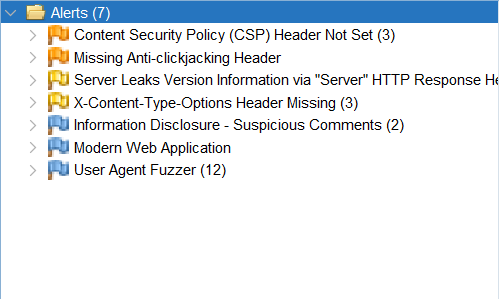

Sources:

OpenWeatherMap API: https://openweathermap.org/current
Unsplash API: https://unsplash.com/
Edamam Recpie Creator API: https://www.edamam.com/

AI Prompts:

< lab 2 original assignment fed to chatgpt to get baseline structure >

Generate an HTML structure for a webpage that has two columns: one for inputting weather and recipe data and another for displaying weather and recipe information. The page should include input fields for weather condition, temperature, and recipe titles. Add buttons to fetch and submit data for both sections.

Provide CSS styling for the webpage where the left column is for editing weather and recipe data, and the right column is for displaying the fetched data. The layout should be responsive, and the input fields should be aligned with the submit buttons. Ensure the columns are well-spaced, and use a modern color scheme.

Write JavaScript code to fetch a random image from the Unsplash API and set it as the background image for the left column of the webpage. The image should cover the entire column, and the background should be responsive.

Generate JavaScript code that fetches weather data from an API and displays it in the right column. Add functionality to update the weather data using input fields in the left column. The weather data should include condition, temperature, and an icon.

Generate JavaScript code that fetches seasonal recipe data and displays it in the right column. Include functionality to allow users to edit the recipe titles through input fields in the left column. The changes should be submitted to update the displayed data.

Align the input fields and submit buttons in each section (weather and recipes) side by side in the left column. Ensure proper spacing between the fields and buttons to keep the layout clean.

Add CSS styling to include hover effects for the submit buttons, making them change color when hovered over. Also, add slight transitions to make the user interaction smoother.

Adjust the spacing between the weather and recipe sections in the right column and ensure that all content is properly aligned and spaced. Add padding around the content to create a clean layout.

Zap Report
